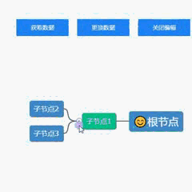

# react-jsmind (已弃用)

⚠️ **此包已被弃用** ⚠️

该项目已迁移到新的作用域包: [@frank17008/react-jsmind](https://www.npmjs.com/package/@frank17008/react-jsmind)

请使用以下命令安装新包:

```
npm install @frank17008/react-jsmind
```

此仓库将不再维护，请尽快迁移到新包。

---

# jsMind React 版

 >) >)  

此项目是基于[jsMind](https://github.com/hizzgdev/jsmind)封装的 React 版本，方便开发者直接以组件形式使用。

1. 安装

```
npm install react-jsmind

// # or

yarn add react-jsmind
```

2. 基本使用



```tsx
import ReactJsMind from "react-jsmind";
import "react-jsmind/dist/index.min.css";

const App = () => {
  const mindRef: any = useRef(null);
  const [editable, setEditable] = useState(true);
  const getData = () => {
    if (mindRef.current) {
      const data = mindRef.current.getData();
      alert(JSON.stringify(data));
    }
  };
  const NodeTreeData = {
    meta: { name: "mind图", author: "Your Name", version: "0.8.5" },
    format: "node_tree",
    data: {
      id: "root",
      topic: "😊根节点",
      children: [
        {
          id: "1",
          topic: "子节点1",
          direction: "left",
          expanded: true,
          "background-color": "#03BF8A",
          children: [
            { id: "2", topic: "子节点2" },
            { id: "3", topic: "子节点3" },
          ],
          data: { width: 100, type: "rect" }, // 自定义业务数据
        },
      ],
    },
  };
  const enableEdit = () => {
    setEditable(!editable);
  };
  const onNodeClick = (node) => {
    console.log("点击的节点", node);
  };
  return (
    <div style={{ width: "100%", height: 800 }}>
      <div className="btns">
        <button onClick={getData}>获取数据</button>
        <button onClick={enableEdit}>{editable ? "关闭" : "开启"}编辑</button>
      </div>
      <ReactJsMind
        ref={mindRef}
        options={{ editable }}
        data={NodeTreeData}
        onClick={onNodeClick}
      />
    </div>
  );
};
```

3.  特性说明

    1. 默认情况下，ReactJsMind 组件会自动渲染一个 id 为 `jsmind_container` 的容器且充满父容器，因此需要在父容器定义宽高。

    2. ReactJsMind 组件 `options` 参数配置请参考[jsMind 参数配置](https://github.com/hizzgdev/jsmind/blob/master/docs/zh/2.options.md); `data` 参数配置请参考[jsMind 数据格式](https://github.com/hizzgdev/jsmind/blob/master/docs/zh/1.usage.md)

    3. ReactJsMind 组件支持`onClick`、`onMouseOver`、`onMouseOut`、`onMouseLeave`、`onMouseLeave`、`onContextMenu`、`onKeyUp`、`ondblClick`、`onExpand` 事件
    4. ReactJsMind 组件只对外暴露了如下几种常用方法, 可以通过 `mindRef.current`调用, 如果想要其他方法，通过 `mindRef.current.getInstance()` 获取到 `jsMind` 实例后调用，具体参考[jsMind 节点操作方法](https://github.com/hizzgdev/jsmind/blob/master/docs/zh/3.operation.md)

|     _方法名_     |                                                                                         参数                                                                                          |            _描述_            |
| :--------------: | :-----------------------------------------------------------------------------------------------------------------------------------------------------------------------------------: | :--------------------------: |
|    screenShot    |                                                                                                                                                                                       | _导出为 png 图片 (不含水印)_ |
|     getData      |                                                                                                                                                                                       |         获取脑图数据         |
| getSelectedNode  |                                                                                                                                                                                       |        获取选中的节点        |
|    expandAll     |                                                                                                                                                                                       |         展开所有节点         |
|     addNode      |     (_parent_node_, _node_id_, _topic_, _data_, _direction_)：<br />parent_node:父节点<br />node_id：唯一标识<br />topic: 名称<br />data: 数据<br />direction: 'left' \| 'right'      |           添加节点           |
|    removeNode    |                                                                                        _node_                                                                                         |           删除节点           |
|   setNodeColor   |                      _(nodeId_, _bg_color_, _fg_color_）：<br />bg_color：React.CSSProperties['color'] 背景色<br />fg_color: React.CSSProperties['color'] 前景色                      |        设置节点背景色        |
| setNodeFontStyle | (_nodeId_, _size_, _weight_, _style_)：<br />_size_: React.CSSProperties['fontSize'],<br />_weight_: React.CSSProperties['fontWeight']<br />_style_: React.CSSProperties['fontStyle'] |       设置节点字体样式       |
|   getInstance    |                                                                                                                                                                                       |       获取 jsMind 实例       |
